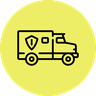

# C3F

[![JavaScript Style Guide][badge-1-img]][badge-1-link]

This app idea was my mom's. Briefly, it helps her with some repetitive calculations.

Since I wanted to study React Native and ReasonML, I began this toy project. Two birds with one stone.

## Logo

The icon was make by [Freepik][1] from [Flaticon][2].

It was edited with [SVG Editor][3] and formatted with [MakeAppIcon][4] and [Gorilla Image][5].

## License

This project code is in the public domain. See the [LICENSE file][6].

[badge-1-img]: https://img.shields.io/badge/code_style-standard-brightgreen.svg
[badge-1-link]: https://standardjs.com

[1]: https://www.flaticon.com/authors/freepik
[2]: https://www.flaticon.com/free-icon/automobile_1785810
[3]: https://svg-edit.github.io/svgedit/
[4]: https://makeappicon.com
[5]: https://apetools.webprofusion.com/#/tools/imagegorilla
[6]: https://github.com/Nhanderu/c3f/blob/master/LICENSE
